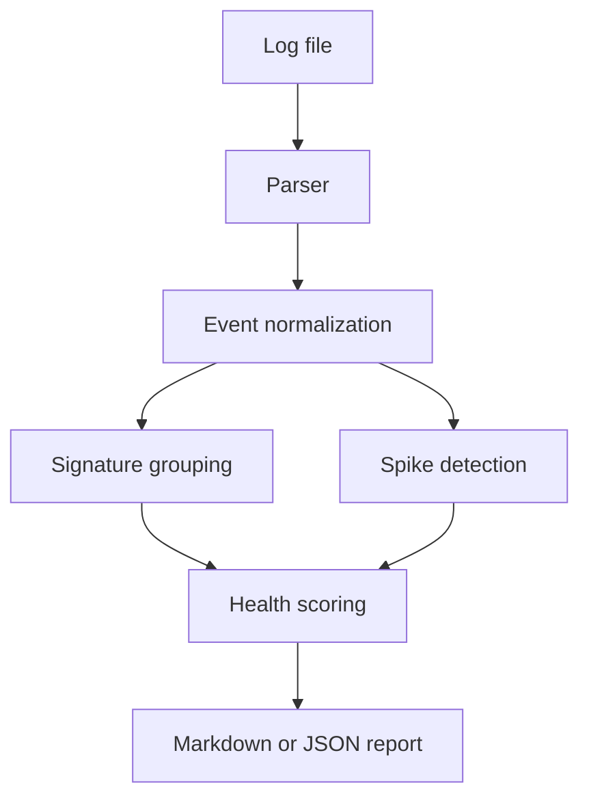

# OpsPulse — Production Incident Triage Toolkit

[](https://github.com/Sowgoto/opspulse/actions/workflows/ci.yml)
[](https://www.python.org/)
[](LICENSE)

OpsPulse is a lightweight Python CLI that turns Linux and application logs into an actionable incident report. It identifies error patterns, detects time-window spikes, calculates a health score, and recommends the next troubleshooting steps.

This portfolio project demonstrates practical production-support skills: log-driven troubleshooting, incident triage, Python automation, Linux, Docker, testing, and CI/CD.

## What it does

- Parses common plain-text and JSON log formats
- Normalizes `DEBUG`, `INFO`, `WARNING`, `ERROR`, and `CRITICAL` events
- Groups repeated errors into signatures while masking IDs and IP addresses
- Detects abnormal error spikes in configurable time windows
- Produces Markdown and JSON incident reports
- Returns a nonzero exit code for unhealthy logs, making it CI/monitoring friendly
- Runs without third-party runtime dependencies

## Quick start

```bash
git clone https://github.com/YOUR-USERNAME/opspulse.git
cd opspulse
python -m opspulse analyze examples/sample-production.log --output report.md
```

Preview the generated report:

```bash
cat report.md
```

Generate machine-readable JSON:

```bash
python -m opspulse analyze examples/sample-production.log \
  --format json --output report.json
```

## Example result

```text
Health score: 15/100 (CRITICAL)
Events analyzed: 20
Errors: 7 | Critical: 1 | Warnings: 3
Peak error window: 8 errors at 2026-09-17 02:01 UTC
Top signature: payment gateway timeout (4 occurrences)
```

See the full generated example in [`examples/sample-report.md`](examples/sample-report.md).

## Supported input

Plain text:

```text
2026-09-17T02:01:08Z ERROR payment-api payment gateway timeout transaction_id=784513 upstream=10.2.4.18
```

JSON lines:

```json
{"timestamp":"2026-09-17T02:01:08Z","level":"ERROR","service":"payment-api","message":"payment gateway timeout transaction_id=784513"}
```

Unparseable lines are retained as `INFO` events so the tool never silently drops input.

## CLI options

```text
python -m opspulse analyze LOGFILE
  --format {markdown,json}  Report format (default: markdown)
  --output PATH             Write report to a file (default: stdout)
  --window MINUTES          Spike-detection window (default: 5)
  --threshold COUNT         Errors that define a spike (default: 5)
  --fail-score SCORE        Exit 2 below this score (default: 60)
```

## Docker

```bash
docker build -t opspulse .
docker run --rm -v "$PWD/examples:/data:ro" opspulse \
  analyze /data/sample-production.log
```

## Testing and quality

```bash
python -m unittest discover -s tests -v
python -m compileall opspulse
```

GitHub Actions runs both checks on Python 3.11, 3.12, and 3.13 for every push and pull request.

## Architecture



## Roadmap

- Syslog/RFC 5424 parsing
- Prometheus metric export
- Optional Slack incident notification
- Baseline learning across multiple log files

## Security and privacy

OpsPulse processes files locally. It does not transmit logs. Error signatures mask IPv4 addresses, UUIDs, and long numeric identifiers before including them in a report. Review reports before sharing because application messages may still contain sensitive data.

## Author

**Sowgoto Raha Sunny**  
Systems & DevOps Support Engineer | M.S. Cybersecurity | AWS Certified Solutions Architect – Associate

## License

MIT — see [`LICENSE`](LICENSE).
